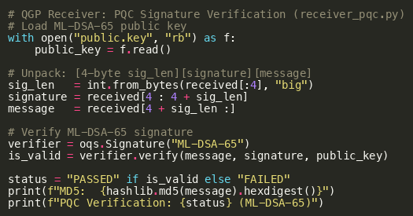
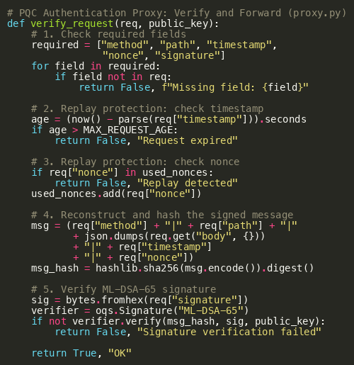
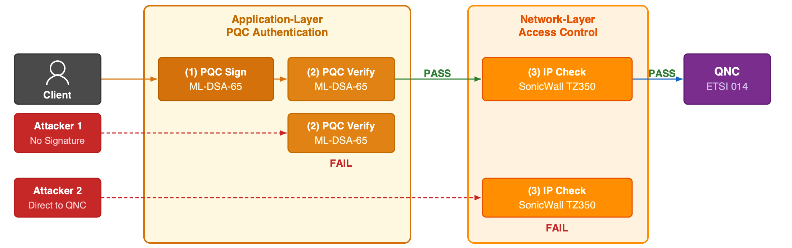
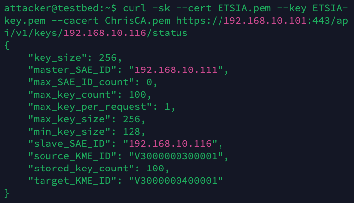
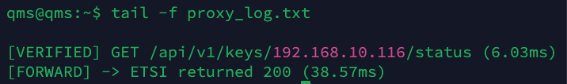
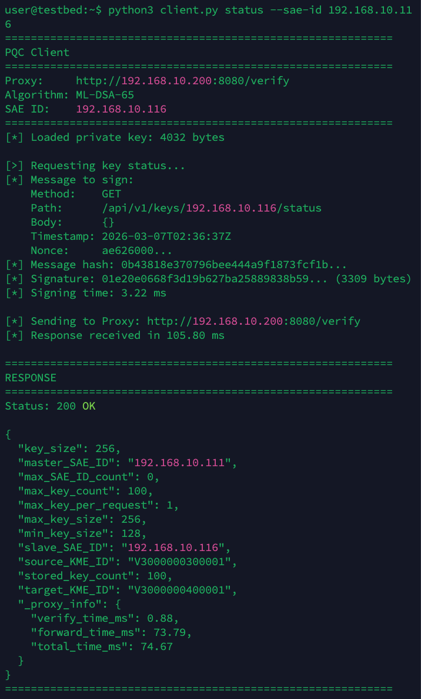
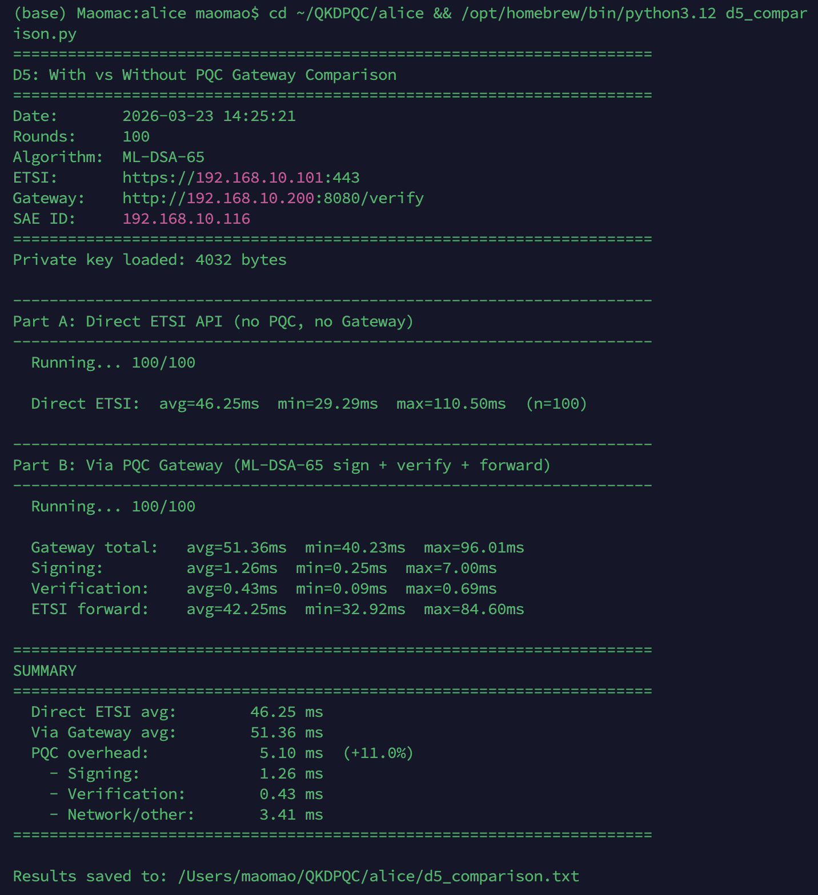
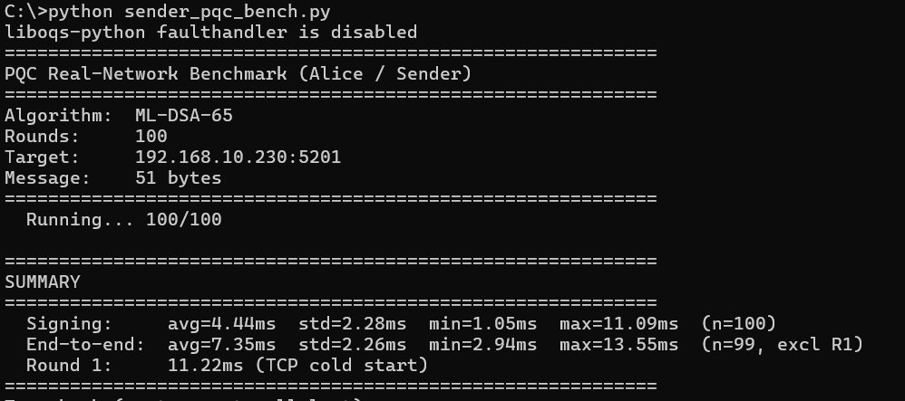
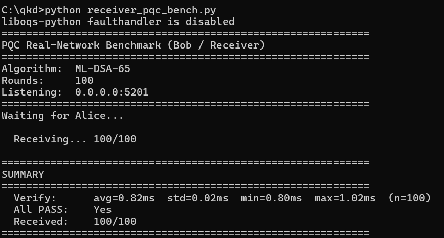

# QGP-QKD-Implementation

Source code and supplementary figures for:

**"Implementation of QGP with Quantum Key and Post-Quantum Authentication"**

## Code Listings

### Fig. 1: QGP Sender (`sender_pqc.py`)
Alice signs a message with ML-DSA-65 and sends the signed packet through the CN4010 QKD-encrypted channel.


Source: [`src/sender_pqc.py`](src/sender_pqc.py)

---

### Fig. 2: QGP Receiver (`receiver_pqc.py`)
Bob unpacks the received data, extracts the signature and message, and verifies the ML-DSA-65 signature.



Source: [`src/receiver_pqc.py`](src/receiver_pqc.py)

---

### Fig. 3: Key Interception via ETSI 014 API (`grab_keys.py`)
Demonstrates the ETSI 014 access isolation vulnerability by intercepting QKD keys at 2 keys/second.


Source: [`src/grab_keys.py`](src/grab_keys.py)

---

### Fig. 4: PQC Authentication Proxy (`proxy.py`)
Verifies ML-DSA-65 signatures on each ETSI 014 API request before forwarding to the QNC.



Source: [`src/proxy.py`](src/proxy.py)

---

### Fig. 5: PQC Client (`client.py`)
Constructs signed API requests with ML-DSA-65 for the PQC authentication proxy.


Source: [`src/client.py`](src/client.py)

---

## Architecture

### Fig. 8: Defense-in-Depth Architecture
Legitimate requests pass through both PQC signature verification and firewall IP check before reaching the QNC. Each attacker path is blocked by a different security layer.



---

## Experimental Output

### Fig. 6: E3 — Proxy Only (3 tests)
Test 1: signed request via proxy succeeds (200 OK). Test 2: attacker bypasses proxy and connects directly to QNC (200 OK). Proxy log: only Test 1 is recorded; Test 2 is invisible to the proxy.





---

### Fig. 7: E4 — Firewall + Proxy (3 tests)
Test 1: direct QNC access refused by firewall. Test 2: unsigned proxy request rejected. Test 3: PQC-signed request succeeds (200 OK).




---

### Fig. 9: PQC Proxy Overhead Raw Output (100 rounds)
Raw terminal output comparing direct ETSI API access with PQC proxy access.



---

### Fig. 10: Alice ML-DSA-65 Signing Benchmark (100 rounds)
Signing latency per round through the CN4010 QKD-encrypted channel.



---

### Fig. 11: Bob ML-DSA-65 Verification Benchmark (100 rounds)
Verification latency per round. All 100 rounds passed.



---

## Requirements

- Python 3.10+
- [liboqs-python](https://github.com/open-quantum-safe/liboqs-python)

## Citation

```bibtex
@article{mao2026qgp,
  title={Implementation of QGP with Quantum Key and Post-Quantum Authentication},
  author={Mao, Jianzhou and Xu, Guobin and Sakk, Eric and Wang, Shuangbao Paul},
  journal={IEEE Journal on Selected Areas in Communications},
  year={2026}
}
```
