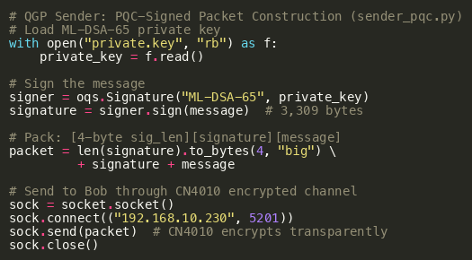
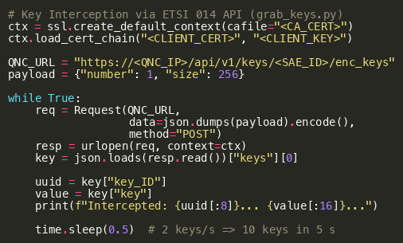
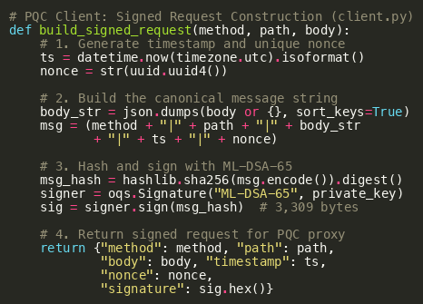
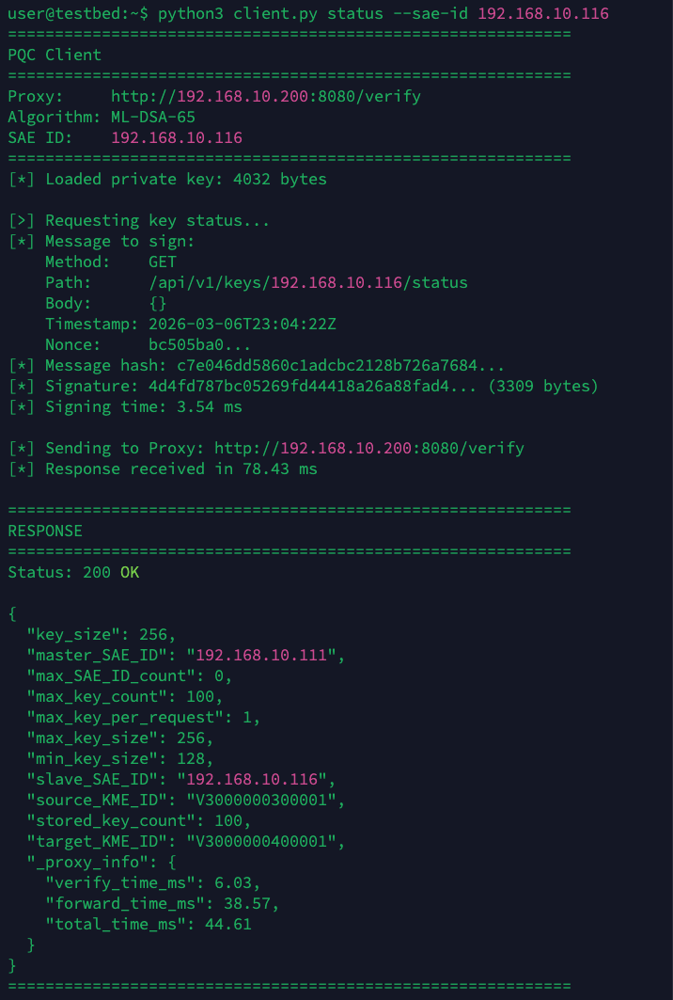
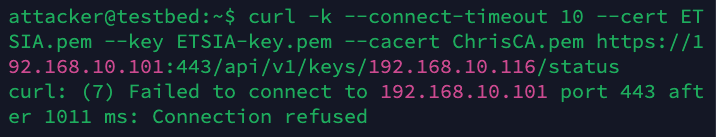
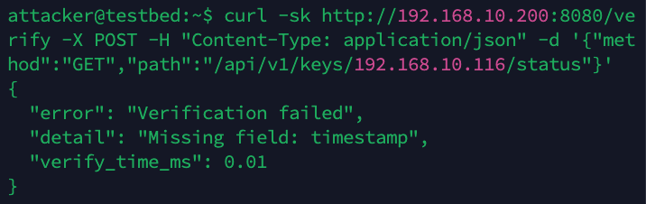
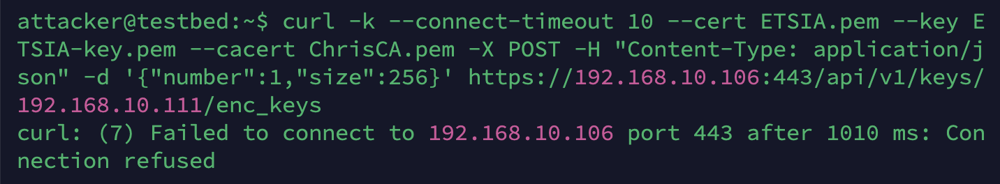
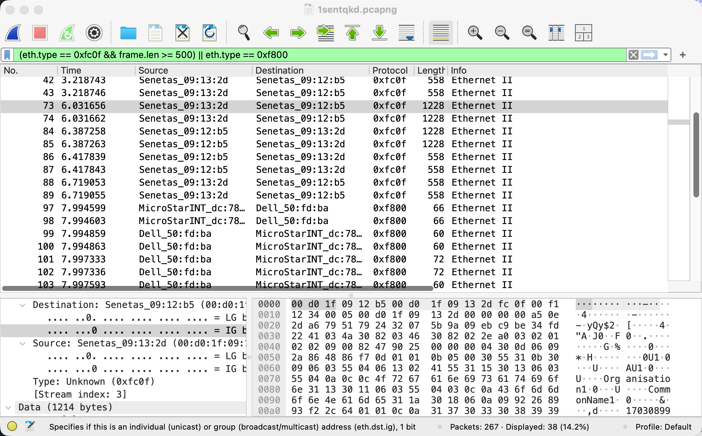
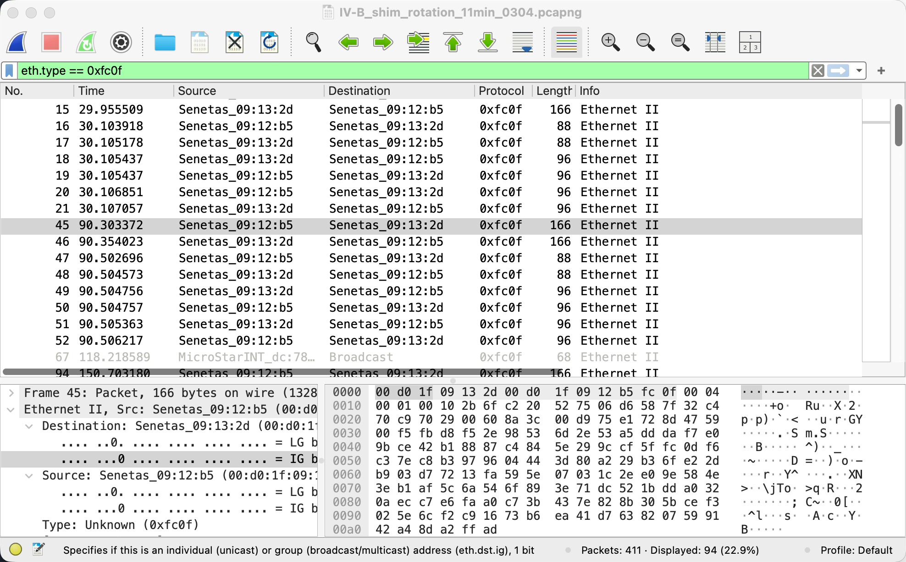
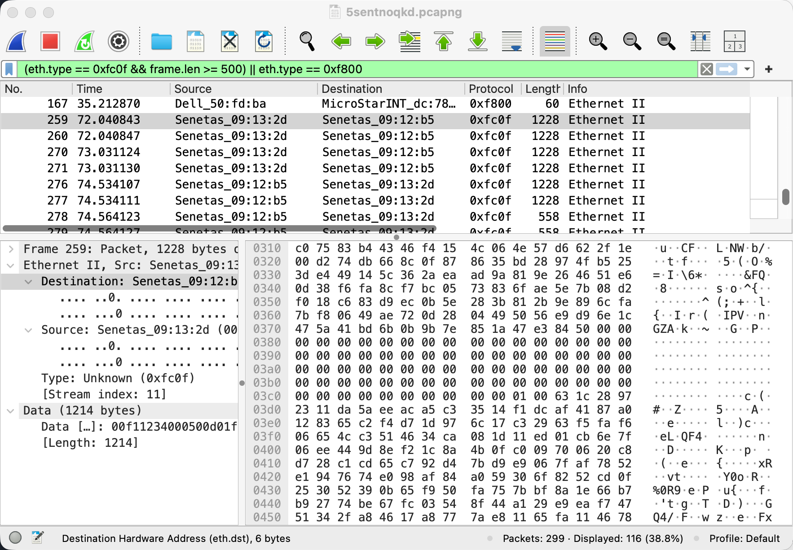

# QGP-QKD-Implementation

Source code and supplementary figures for:

**"Toward Verified Quantum-Safe Communication: Network Authentication with Quantum Key Encryption and Post-Quantum Signatures"**

## Code Listings

### Fig. S1: QGP Sender (`sender_pqc.py`)
Alice signs a message with ML-DSA-65 and sends the signed packet through the CN4010 QKD-encrypted channel.

Source: [`src/sender_pqc.py`](src/sender_pqc.py)

---

### Fig. S2: QGP Receiver (`receiver_pqc.py`)
Bob unpacks the received data, extracts the signature and message, and verifies the ML-DSA-65 signature.

Source: [`src/receiver_pqc.py`](src/receiver_pqc.py)

---

### Fig. S3: Key Interception via ETSI 014 API (`grab_keys.py`)
Demonstrates the ETSI 014 access isolation vulnerability by intercepting QKD keys at 2 keys/second.

Source: [`src/grab_keys.py`](src/grab_keys.py)

---

### Fig. S4: PQC Authentication Proxy (`proxy.py`)
Verifies ML-DSA-65 signatures on each ETSI 014 API request before forwarding to the QNC.

Source: [`src/proxy.py`](src/proxy.py)

---

### Fig. S5: PQC Client (`client.py`)
Constructs signed API requests with ML-DSA-65 for the PQC authentication proxy.

Source: [`src/client.py`](src/client.py)

---

## Architecture

### Fig. S6: Defense-in-Depth Architecture
Legitimate requests pass through both PQC signature verification and firewall IP check before reaching the QNC. Each attacker path is blocked by a different security layer.

---

## Experimental Output

### Fig. S7: E3 — Proxy Only (3 tests)
Test 1: signed request via proxy succeeds (200 OK). Test 2: attacker bypasses proxy and connects directly to QNC (200 OK). Proxy log: only Test 1 is recorded; Test 2 is invisible to the proxy.

---

### Fig. S8: E4 — Firewall and Proxy (3 tests)
Test 1: direct QNC access refused by firewall. Test 2: unsigned proxy request rejected. Test 3: PQC-signed request succeeds (200 OK).

---

### Fig. S9: E2 — Firewall Only
The SonicWall TZ350 firewall refuses the attacker's direct connection to QNC B (response time 1010 ms, TCP RST). The firewall's DENY rule blocks all traffic from non-whitelisted source addresses to the QNC ETSI 014 endpoints, while the ALLOW rules permit the two CN4010 encryptors' 60-second key rotation cycles to proceed uninterrupted.

---

### Fig. S10: SHIM Frame Timeline
Wireshark capture showing SHIM key exchange frames (0xFC0F) preceding encrypted data frames (0xF800) by approximately 2 seconds.

---

### Fig. S11: SHIM Key Rotation Periodicity
SHIM key rotation captured over 11 minutes at uniform 60.4 s intervals.

---

### Fig. S12: SHIM Hex Dump — CNET Mode
CNET mode hex dump showing zeros in the UUID region at offset 0x0380, compared with QKD mode which contains ASCII-encoded key UUIDs.

---

## Requirements

- Python 3.10+
- [liboqs-python](https://github.com/open-quantum-safe/liboqs-python)
